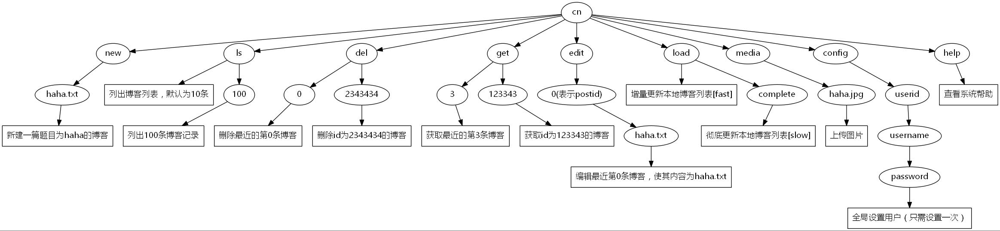

TODO:  
* 使用Lucene实现检索功能
* 文本分类
* 博客自动分类

以博客园为基础，实现自然语言相关技术，包括：
* 关键词抽取
* 检索
* 文本聚类
* 词云图
* 文本分类 
* 部署在服务器上
* 合并旧的文章
* 可以集成markdown，来作为博客园客户端
* [博客园新闻接口](http://wcf.open.cnblogs.com/news/)
* zzk.cnblogs.com找找看，十分强大的搜索功能

## 本项目功能清单：
* 本项目使用SpringBoot作为后台框架，使用jstree插件结合博客园建立随笔分类小工具。
* 基于博客园开放的XMLRPC接口规范完成Java程序访问博客园
* 基于httpclient和jsoup实现爬虫，抓取博客园文章列表
* 实现命令行程序，通过命令行调用访问博客园功能

## 命令列表

一共有六个命令：
* new cmd.txt：新建博客，博客题目为haha，博客内容为haha.txt文件内容
* ls ：查看博客列表，`ls 15`查看最近15条记录
* edit postid cmd.txt ：将postid的内容替换为haha.txt
* del postid ：删除博客，删除之前会自动备份到本地
* load ：加载博客，有两种模式：增量模式和彻底模式，增量模式只更新最近的博客，彻底模式从头更新
* get postid：下载博客，将博客下载到本地

以上出现postid的地方，表示博客园博客的id。  
为了简便起见，对于最近10条博客记录，可以使用0~10之间的数字进行表示，比如0表示最新的那条博客。
使用命令`edit 5 cmd.txt`编辑最近的第6篇博客。

ls命令查看的博客列表是缓存下来的，这个缓存的博客列表可以通过load命令进行更新。  
`load`命令表示增量更新，`load complete`表示彻底更新列表。增量更新每次只查看博客园有那些更
改，将这些更改应用到本地列表，这种方式弊端在于无法检测已经删除过的博客。彻底
更新会从头到尾扫描随笔列表，这样比较耗时。

随笔和本地文件的对应关系如下：文件名称表示博客题目，文件内容表示随笔内容。

## 本项目语言为Java8，所用到库如下所示：
* fastjson：JSON解析工具库
* apache data-commons：XMLRPC工具库
* apache httpclient：网络请求工具
* jsoup：html页面解析工具
